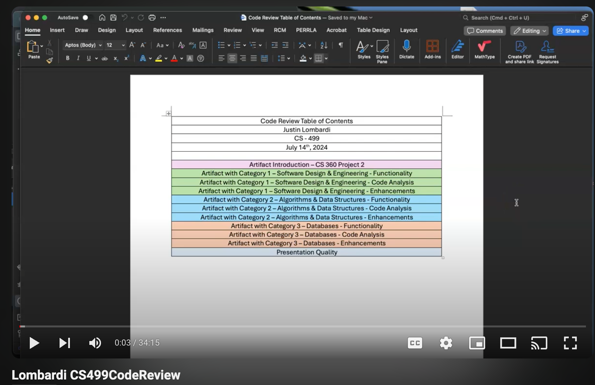
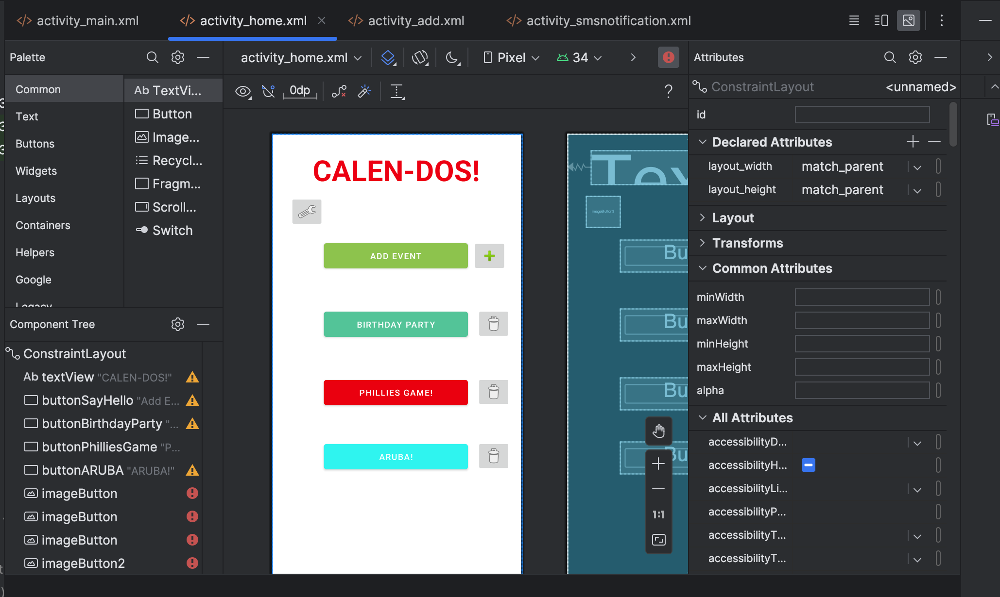
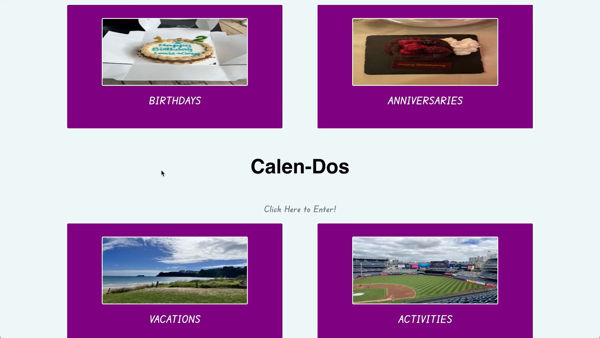
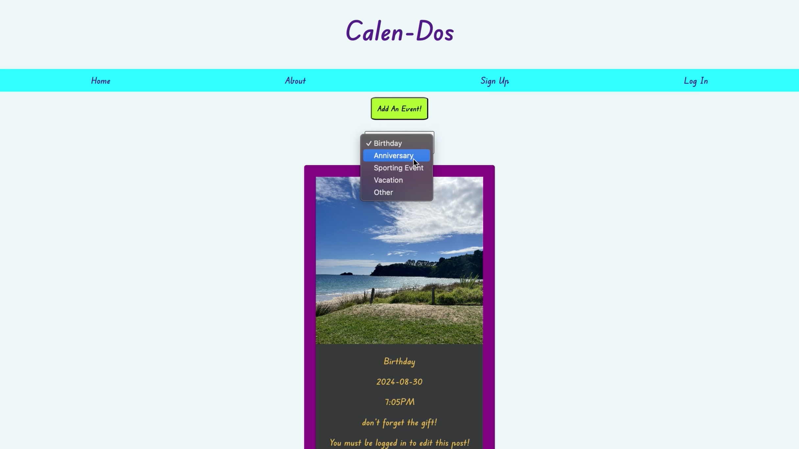
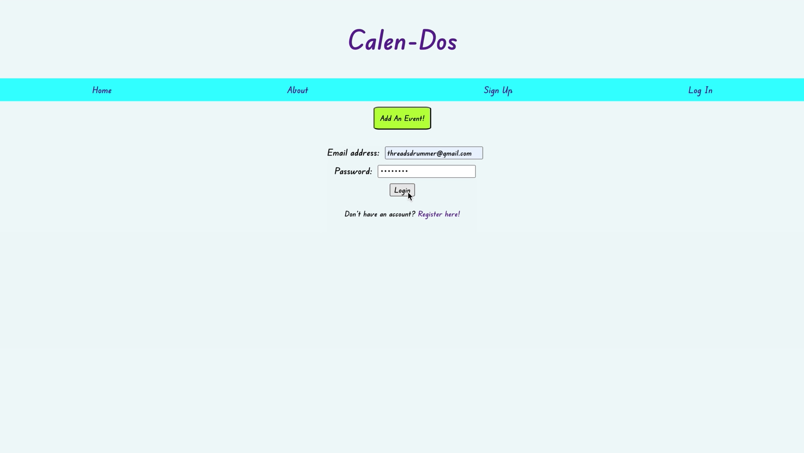

  

# Welcome to Justin Lombardi's ePortfolio!

### Computer Science Capstone 499 at SNHU

## Table of Contents
<ul>
  <li>Professional Self-Assessment</li>
  <li>Code Review</li>
  <li>Original Artifact</li>
  <li>Enhancement One Demo & Narrative: Software Engineering & Design </li>
  <li>Enhancement Two Demo & Narrative: Data Structures & Algorithms</li>
  <li>Enhancement Three Demo & Narrative: Databases</li>
</ul>

## Professional Self-Assessment

Completing my coursework at SNHU and developing my ePortfolio has helped shape my professional goals and values by showing me that I’m capable of much more than I think. The assignments, projects, and discussions have all contributed to my work in this field and have helped to enhance my abilities in tough situations. The online learning environment has also been a helpful piece of this puzzle as it forced me to reach out for clarifying information, make better connections with peers, and drive the solution mindset by having to research to help solve my own problems. CS – 330 was a computational graphics course and by far one of the most challenging courses in this program as it was far from my comfort zone. I was comfortable with the language and building a full-stack application, but the content and structure for graphics was  an incredibly deep dive. However, the collaboration with my peers and the communication with my professor allowed me to gather better understanding of the weekly problems. I was able to overcome code issues, bugs, and build a deeper understanding of the content with these communications. All the support from SNHU inside and outside the classroom provided me with the resources to succeed. My goal in this program was not only to learn the hard skills of computer science, but to develop the soft skills needed to overcome discomfort in a new field and to work more efficiently with peers, professors/stakeholders, and mimic what a real-world scenario would be when applicable. I was able to see myself grow in my current career during this time because my experience here changed how I approach new topics and new challenges. I approach tasks at work with a newfound confidence and the ability to articulate the exact needs of the business and how I can solution for those needs in a more concise way. With all this in mind, the program and coursework has taught me how to take a concept, think deeply about the solution, and build a product in many ways to best solve for a problem, especially for these final enhancements.

I chose one main artifact to use in this final ePortfolio to showcase my skills in Software Design & Engineering, Data Structures & Algorithms, and Databases. The artifact that was chosen for this ePortfolio to enhance was originally a mobile application built in one of my last terms from SNHU for CS – 360. The artifact is called “Calen-Dos” and is an event-tracking app that is supposed to bring a fun interaction to event planning. It was originally created in Android Studio; however, I rebuilt and enhanced the artifact by converting the idea to a browser-based, full stack application and built it using the MERN stack. I selected this item because I did like the idea behind the project, but I did not like the exact build and design idea for a mobile application. The conversion to a browser-based application will show the growth I’ve had during my time at SNHU since I built the new app with some technologies we have only briefly covered during our terms and some we have not covered at all. I wanted to challenge myself because this was a bareboned design, and there was room to elevate and scale this application. The thought behind using this artifact revolved around the fact that it lacked two of the three categories initially (algorithms and databases), so there was an opportunity to build these categories from scratch as a true enhancement. Below you will find the link to the original artifact repository followed by the links and demos of each enhancement by category for my main artifact.

## Code Review 
View the code review for the original artifact of this capstone <a href="https://youtu.be/wBpu8ryyRQ0" title="here!">here!</a>

## Original Artifact
Source code for the original artifact <a href='https://github.com/JLombardi427/CS-360/tree/main/LombardiJustin_CS360_ProjectTwo'>here!</a> 

## Enhancement One Demo & Narrative: Software Engineering & Design
Source code for the entire front end design <a href='https://github.com/JLombardi427/eportfolio/tree/main/eportfolio-frontend'>here!</a> 

Course outcomes covered are One, Two, and Three.

The artifact that was chosen for this ePortfolio to enhance was originally a mobile application built last term from CS – 360. The artifact is called “Calen-Dos” and is an event-tracking app that is supposed to bring a fun interaction with our event planning. It was originally created in Android Studio, however, I will be rebuilding and enhancing the artifact by converting the idea to a browser-based, full stack application and build it using the MERN stack. I selected this item because I did like the idea behind the project, but I did not like the exact build and design idea for a mobile application. 

I employed strategies for building collaborative environments that enable diverse audiences to support organizational decision-making in the field of computer science by building a functional app that provides a more interactive and smoother design than the original artifact. This enhanced artifact relies on React to deliver a clean, organized interface for the user so they can have a modern and crisp feel. In our course program, we have only worked with Angular, so implementing React was a new challenge that I wanted to dive into to meet our course outcome and build a collaborative environment. I also designed, developed, and delivered professional-quality oral, written, and visual communications that are coherent, technically sound, and appropriately adapted to specific audiences and contexts by providing commented and refactored source code into the enhanced artifacts. I did this by ensuring that any developer coming into this codebase could identify my intent in the functionality with these comments and organizing the code by variables, dependencies, functions, and state variables. The use of React’s various hooks allowed me to organize the components in such a way that dataflow and component layouts are succinct and efficient. I demonstrated an ability to use well-founded and innovative techniques, skills, and tools in computing practices for the purpose of implementing computer solutions that deliver value and accomplish industry-specific goals by implementing the filtering and mapping option. These functions in Javascript both use O(n) time and space complexity which can also be labeled as linear time complexity (Le, 2023).

Most of the challenges I met during this process was setting up the different components in the way I wanted them to come across. The planning stage along with the diagrams helped tremendously in creating a visual and I am coming close to meeting the standards for this enhancement. Another challenge I’m facing with this enhancement is also getting lost in refactoring the code. I’m trying to make the code and components efficient, however, I’m getting caught up in some of the “clean up” work which delays the focus on some of the other features I’d like to work on and incorporate. The struggle comes in the balance of wanting to do all the touch-up coding at once and wanting to get the entire conversion at an MVP (Minimum Viable Product) stage. While it is easy to get carried away with the flashy add-ons with this conversion and “new” artifact, the important part of the entire enhancement process is also ensuring the artifact is in true, working order.

View the Enhancement One Demo <a href="https://youtu.be/73I5rFAYJwk" title="here!">here!</a>

## Enhancement Two Demo & Narrative: Data Structures & Algorithms

Component containing the filter logic with state variables <a href='https://github.com/JLombardi427/eportfolio/blob/main/eportfolio-frontend/src/Components/Home/Home.js'>here!</a>

Course outcomes covered are Three and Four.

The artifact that was chosen for this ePortfolio to enhance was originally a mobile application built last term from CS – 360. The artifact is called “Calen-Dos” and is an event-tracking app that is supposed to bring a fun interaction with our event planning. It was originally created in Android Studio, however, I will be rebuilding and enhancing the artifact by converting the idea to a browser-based, full stack application and build it using the MERN stack. I selected this item because I did like the idea behind the project, but I did not like the exact build and design idea for a mobile application. 

I demonstrated an ability to use well-founded and innovative techniques, skills, and tools in computing practices for the purpose of implementing computer solutions that deliver value and accomplish industry-specific goals by implementing the filtering and mapping option. These functions in Javascript both use O(n) time and space complexity which can also be labeled as linear time complexity (Le, 2023). In this stage, I was also able to design and evaluate computing solutions that solve a given problem using algorithmic principles and computer science practices and standards appropriate to its solution while managing the trade-offs involved in design choices by leveraging React’s useState hook to load and store the data from the database and manage state variables to increase optimization and functionality. Using the state variables along with the filter and map options allowed for the use of linear time complexity while also having a function that filtered the events and triggered the change of state instead of re-rendering the entire page. I currently have some test data in the database that I was able to use for the build of the filter for the website. When you first load the Home component, you are met with all events and there is a filter where you can choose the category for your events. If you choose a category that does not have any posts in it, you are met with a message that states there are no events in that category yet. Along with the message, you will also be met with a link to the “Add Event” component, and it will bring you to the form.

The biggest challenge for this part of the artifact was getting the proper objects from the database to render depending on the input of the option that was selected from the filter drop down. I spent significant time trying to get the configuration right when I wanted to. I have this in a working order now; however, I want to have an “All” option that displays all the events from all categories. Right now, I have it set up to either display from the category or display the edge case message if no events are found. I know it will require another piece of a conditional, but I haven’t thought of the proper configuration to get that to happen just yet. Another challenge I had was getting to successfully create a post from the site. I have it configured, and I have tested the path, but I’m running into authentication issues and passing the logged in information between the components. I figured since I needed to have a database to properly incorporate my algorithm, I would build the database to save time and this way I can spend the next week refining the artifact and figuring out any loose bugs.

View the Enhancement Two Demo <a href="https://youtu.be/JxkVdqV39sM" title="here!">here!</a>

## Enhancement Three Demo & Narrative: Databases

Repository for the backend <a href='https://github.com/JLombardi427/eportfolio/tree/main/backend-eportfolio'>here!</a>

The artifact that was chosen for this ePortfolio to enhance was originally a mobile application built last term from CS – 360. The artifact is called “Calen-Dos” and is an event-tracking app that is supposed to bring a fun interaction with our event planning. It was originally created in Android Studio, however, I will be rebuilding and enhancing the artifact by converting the idea to a browser-based, full stack application and build it using the MERN stack. I selected this item because I did like the idea behind the project, but I did not like the exact build and design idea for a mobile application.  
 
I employed strategies for building collaborative environments that enable diverse audiences to support organizational decision-making in the field of computer science by building a functional app that provides a more interactive and smoother design than the original artifact. This enhanced artifact relies on React to deliver a clean, organized interface for the user so they can have a modern and crisp feel. In our course program, we have only worked with Angular, so implementing React was a new challenge that I wanted to dive into to meet our course outcome and build a collaborative environment. I demonstrated an ability to use well-founded and innovative techniques, skills, and tools in computing practices for the purpose of implementing computer solutions that deliver value and accomplish industry-specific goals by implementing the filtering and mapping option. These functions in Javascript both use O(n) time and space complexity which can also be labeled as linear time complexity (Le, 2023). I developed a security mindset that anticipated adversarial exploits in software architecture and designs to expose potential vulnerabilities, mitigate design flaws, and ensure privacy and enhanced security of data and resources by building a database that has user authentication and security configured. I was able to develop a backend using MongoDB, Express.js, and Node.js for the routes, models, and controllers while using npm packages such as bcrypt, passport, and json webtoken so I could build out the authentication and hashing of passwords. I started by getting the basic functionality of the database using local JSON data within the project. After I was able to seed the database and establish a connection, then it was time for me to build the routes that would allow forms to be submitted to the database. By using Postman to properly test, I have configured the routes to create, update, read, and delete events while also creating users with hashed passwords. With the backend working properly, I employed strategies for building collaborative environments that enable diverse audiences to support organizational decision-making in the field of computer science by successfully calling the API from the front end and displaying the content from the database. I also designed and evaluated computing solutions that solve a given problem using algorithmic principles and computer science practices and standards by implementing the useContext hook from React, so I only have to make my API call for all events from my parent component. This allows me to drill the state variables down into other components without having to call the API on every component.

The biggest challenge for this part of the artifact was getting the authentication for the users to work. I’m still running into some bugs when I try to create posts from the front end; however, this will be part of my polishing for the week to come. During the process, there is a lot of testing involved with the routes because if one thing is off in the backend, the process breaks, and it is very unforgiving with the accuracy.

View the Enhancement Three Demo <a href="https://youtu.be/7D_eOcTwChw" title="here!">here!</a>

References:
  
Le, K. (2023, April 14). Understanding time and space complexity of common JavaScript built-in methods. Medium. https://javascript.plainenglish.io/understanding-time-and-space-complexity-of-common-javascript-built-in-methods-39a3285a6409

